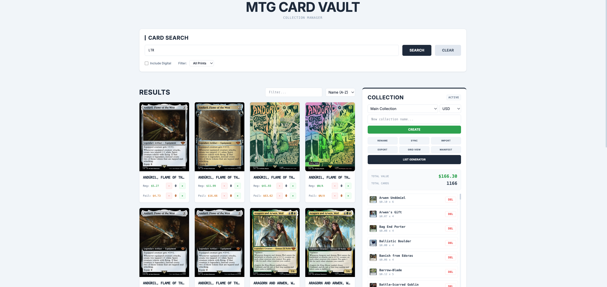

<p align="center">
  
</p>

<p align="center">
  
  
  
  
</p>

<p align="center">
  <code>Single-file Magic: The Gathering collection manager.</code><br/>
  <code>Search sets, track inventory, generate manifests and listing sheets.</code>
</p>

<p align="center">
  
</p>

---

### `>_ FEATURES`

| Feature | Detail |
|:--------|:-------|
| **Set Search** | Query any MTG set via Scryfall API — paginated results with filter and sort |
| **Collection Manager** | Multiple named collections with add/remove, currency toggle (USD/EUR/TIX) |
| **Price Sync** | One-click market price refresh from Scryfall |
| **Import / Export** | Paste or upload `.txt` card lists, export collection to file |
| **Manifest Generator** | Downloadable PNG image — highlight grid, newspaper-column inventory list |
| **List Generator** | Checklist view with select-all and copy-to-clipboard for selling platforms |
| **Visual Grid** | Fullscreen card image gallery with quantity badges |
| **Responsive** | Mobile-first layout, touch-friendly controls, adaptive modals |

---

### `>_ USAGE`

```
Open index.html in any browser. No server required.
```

1. **Search** — enter a set code (e.g. `LTR`, `MOM`, `MH1`) and click Search
2. **Add cards** — use `+`/`-` buttons on each card for regular and foil quantities
3. **Manage** — create, rename, switch, or delete collections
4. **Import** — paste a card list or upload a `.txt` file (format: `4x Sol Ring`)
5. **Export** — download collection as `.txt` with prices
6. **Manifest** — generate a shareable PNG inventory image
7. **List Generator** — select cards and copy formatted listing text

---

### `>_ DATA`

All collection data is stored in the browser's `localStorage`. No account, no server, no tracking.

| Action | What Happens |
|:-------|:-------------|
| **Save** | Writes to `localStorage` — persists across sessions |
| **Sync Prices** | Fetches latest prices from Scryfall Collection API |
| **Export** | Downloads a `.txt` summary with card names, sets, and prices |
| **Manifest** | Renders collection to a `<canvas>` and exports as PNG |

---

### `>_ STACK`

<p>
  
  
  
  
</p>

---

<p align="center">
  <sub>MIT License</sub>
</p>
